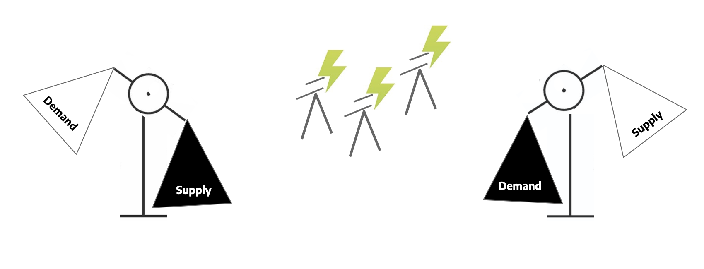
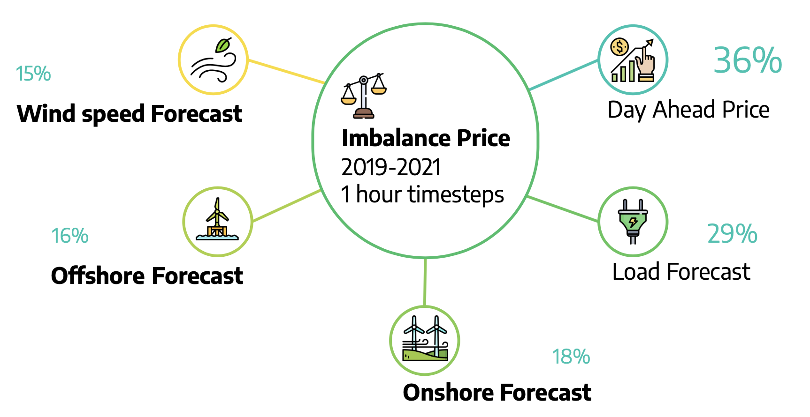

# __Capstone: Predicting the imbalance energy price__

This was the capstone project done at the Data Science Bootcamp @neuefische. This project has been developed in 4 weeks in November 2021 by Aaron Holstein ([Git](https://github.com/AaronsHub) | [LinkedIn](https://www.linkedin.com/in/aaron-holstein/)), Katrin Mulinski ([Git](https://github.com/IronMan2483) | [LinkedIn](https://www.linkedin.com/in/katrin-mulinski-81ab5622/)), Laurent Hartmann ([Git](https://github.com/laurantirkh) | [LinkedIn](https://www.linkedin.com/in/laurent-hartmann-134524bb/)) and Ravi Tripathi ([Git](https://github.com/ravitpt87) | [LinkedIn](https://www.linkedin.com/in/ravi-tripathi-phd-95a128179/)).

---
## __Our topic__

Imbalance energy is the energy fed into or extracted from the power transmission net by the transmission net operator to avoid grid instability and to keep the balance between demand and supply. Our goal is to forecast this highly volatile price for the next several hours to be able to make purchase and sale decisions to avoid losing money in case additional energy is needed.



---

## __Repo structure__

* our final notebooks about preprocessing data, eda and the 2 models sarima and prophet are [here](https://github.com/IronMan2483/neuefische_Capstone/tree/main/final_notebooks)
* used and created images are [here](https://github.com/IronMan2483/neuefische_Capstone/tree/main/images)
* [slides](https://github.com/IronMan2483/neuefische_Capstone/blob/main/slides/Capstone_bendthewind.pdf) used in the final presentation
* <a href="https://www.youtube.com/watch?v=BiMvUGV7Gto&t=6s" target="blank"></a> recorded final presentation

---

## __Data Overview__

After cleaning the data of 1 json and 11 csv files, we aggregated the dataset to an hourly timespan: 2019-01-01 00:00:00 until 2020-09-30 23:00:00

We selected the following features:



---
## __Requirements__

- pyenv with Python: 3.9.4
- Pandas
- Matplotlib
- Seaborn
- Plotly

---
## __Setup__

```
pyenv local 3.9.4
python -m venv .venv
source .venv/bin/activate
pip install --upgrade pip
pip install -r requirements_dev.txt
```

---
